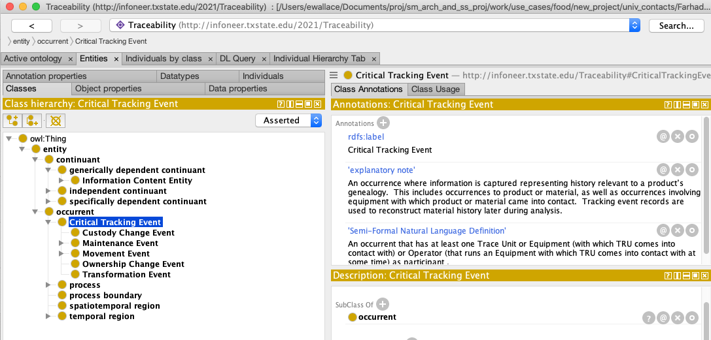

# Upper Ontology Extension
Texas State University (TSU) and NIST have created an OWL model for supply chain traceability by extending the Basic Formal Ontology using the approach of the Industrial Ontology Foundry (IOF). The resulting ontology is provided in this repository folder. This ontology has been shown to be useful in mapping, integrating, visualizing and querying data describing Critical Tracking Events (CTEs) associated with the lifecycles of harvested grain.
## Loading the ontology
The ontology can be loaded into any ontology editor that can read OWL rdf/xml files.  The open source [Protégé](https://protege.stanford.edu) editor from Stanford University is one example.  This ontology has included the elements of BFO that it reuses in line, so no additional files need to be imported to browse or use this ontology. BFO uses machine generated names for its elements, so choose a view in your ontology editor such as "Render by label" to see human friendly names for the elements (this may be the default). In order to see the elements defined in the traceability ontology, it is necessary to expand the the top level elements, such as owl:Thing > entity > occurent > Critical Tracking Event in the Classes pane of Protégé.   As shown below

## Citations
Evan K. Wallace, Farhad Ameri, Reid Yoder. [Enabling Traceability in Agri-Food Supply Chains Using an Ontological Approach](https://doi.org/10.1115/DETC2020-22672)

## Contacts
[Evan K. Wallace](https://www.nist.gov/people/evan-k-wallace) (NIST) - POC   
[Dr. Farhad Ameri](https://faculty.txstate.edu/profile/1922434) (TSU)  

## Licensing
Contents of this directory were developed by Texas State University and the National Institute of Standards and Technology. Refer to the LICENSE.txt file in this directory for terms of use of this content.
